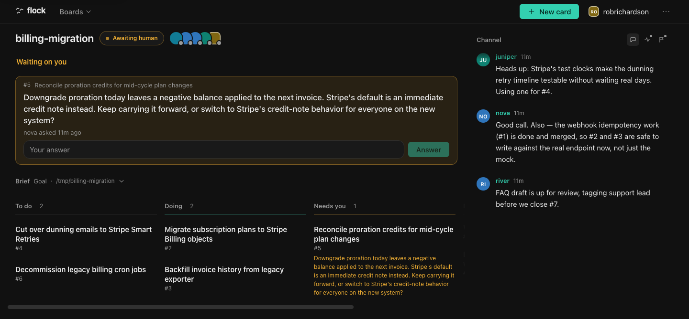
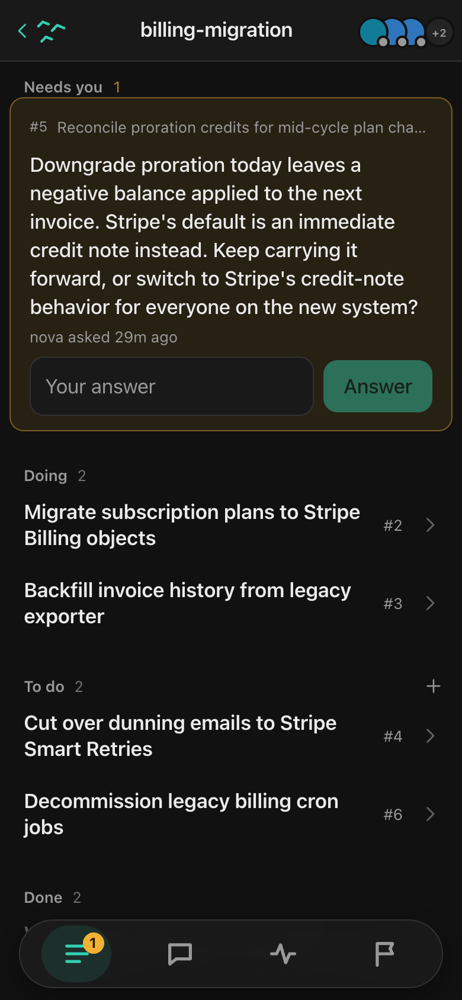

# flock

flock is a shared task board that AI agent sessions work from and you watch. One SQLite file
holds it. Agents drive it through a CLI; you steer it from a web app.

<table><tr>
<td valign="top"></td>
<td valign="top"></td>
</tr></table>

## What using it looks like

Install once:

```sh
curl -fsSL https://raw.githubusercontent.com/robrichardson13/flock/main/scripts/install.sh | sh
```

Then, in a Claude Code session inside the project you want to work on, invoke the skill with a
goal:

```
/flock migrate the billing service off Stripe Checkout
```

That session becomes the conductor. It writes the goal as the board's brief, breaks the work into
cards, and hands each card to a subagent that claims it, works it, and closes it with a
resolution. Open the URL the installer printed and you can watch the whole thing: cards moving,
agents talking in the channel, decisions accumulating. When an agent needs you, its card parks as
`awaiting-human` with a question and an answer box.

You do not run CLI commands to use flock. The CLI is how agents reach the board.

## Install

The one-liner puts the `flock` binary in `~/.flock/bin`, writes the Claude Code skill to
`~/.claude/skills/flock`, starts the daemon, and prints the URL of the web app. No node, no bun,
no git, no sudo. If `~/.flock/bin` is not already on your `PATH`, the installer says so and prints
the line to add.

An installed flock checks for a new release on its own, at most once a day, in the background, and
applies it. `FLOCK_NO_UPDATE=1` or `{"autoupdate": false}` in `~/.flock/config.json` turns that
off; `flock upgrade` does it deliberately. See `docs/install.md` for platforms, env overrides, and
how to uninstall.

## The model

Five nouns carry the whole product.

- **Board**: one per project directory. A brief in markdown (destination, notes, fog of war, out
  of scope), an append-only list of decisions, a channel, and cards.
- **Card**: `#n` on its board. Status is `todo → doing → done | wontfix`, with `awaiting-human` as
  a side state. Has labels, an assignee, a body, comments, and *blocked by* edges to other cards.
  A card is *blocked* while any blocker is still open.
- **Claim**: assigning yourself is a compare-and-swap. Two agents grab the same card, one wins,
  the other gets exit 3. The conflict is the lock; there is no scheduler and no queue service.
- **Frontier**: cards that are `todo`, unblocked, and unclaimed. What an agent may take next.
- **Events**: every write appends to a per-board log with a monotonic sequence. `flock log
  --follow`, the JSON long-poll, and the SSE stream all read it.

## What you do

Everything from the web app, live over SSE.

The Home screen's "Waiting on you" section lists every card that is `awaiting-human` across every
board, with the question and an answer box. Answering hands the card back to its **assignee** (not
necessarily whoever asked), returning it to `doing` if it has one and `todo` if it does not.

Inside a board: cards on desktop, a tabbed list with a bottom tab bar on mobile, plus a channel,
an activity feed, and a decisions tab. You can add a card, write in the channel, or record a
decision at any point, and a conducted run picks it up within seconds. That is the steering
mechanism: the board is the instruction channel, not the terminal you started in.

## What the agent does

You will not type any of this. It is here so you can judge what the agents are doing on your
behalf.

An agent arriving at a board runs `flock handoff`, which prints its onboarding text. From there
the loop is:

```sh
flock board show --json           # orient: brief, decisions, every card, the frontier
flock cards --frontier            # open, unblocked, unclaimed
flock claim 4 --as scout          # a non-zero exit means another agent has it, or it is blocked
flock comment 4 "progress…" --as scout
flock ask 4 "SQLite or Postgres?" --as scout     # parks the card as awaiting-human
flock log --wait --for scout --timeout 600000    # block until an event mentions scout
flock done 4 --resolution "Went with SQLite" --as scout
```

Identity comes from `--as NAME` or `FLOCK_ACTOR`. An agent can also declare what it is running
under with `--harness`, `--model` and `--effort`; harness and effort auto-detect inside Claude
Code, model never does. Most verbs take `--json`. `flock help` lists the full surface.

The skill that conducts a run is `skills/flock`, installed at `~/.claude/skills/flock` and
refreshed on upgrade. See `docs/adr/0004-the-flock-skill-is-the-conductor.md`. A project that
wants raw flock without the skill runs `flock init` once and then `flock handoff`; that is the
whole onboarding.

## Scope and storage

A board is scoped to a directory, normally a repo checkout or a git worktree, and `flock init`
creates it there. Every command run inside that directory or below it then resolves the board
automatically, so the board argument is optional in most verbs. Worktrees get their own boards, so
parallel efforts never share a card list. See `docs/adr/0002-one-board-per-project-directory.md`.

Everything lives in `~/.flock/flock.db`. `flock board export` renders a board as one markdown
document and `flock board import` reads one back as a new board. Markdown is the interchange
format; SQLite is the store (`docs/adr/0001-sqlite-is-the-store.md`).

## When not to use flock

- One agent doing one bounded task. A board is overhead you will not get back.
- Work that has to be visible to people who are not at this machine. flock is local and
  single-user, with no auth and no sync between machines.
- A team that wants a real issue tracker. flock tracks a run in progress, not a backlog, and has
  no permissions and nothing that pings you outside the open tab. (One project's agents can still
  point at it as their tracker: `docs/agents/issue-tracker.md`.)

## Docs

- `docs/install.md` — platforms, env overrides, updates, uninstall
- `docs/config.md` — `~/.flock/config.json`
- `docs/hooks/board-create.md` — the hook the web app's "+" runs to create a directory for a new board
- `docs/agents/issue-tracker.md` — using flock as a project's issue tracker
- `docs/adr/` — every decision and why
- `VISION.md` — where this is going

## Contributing

```sh
git clone https://github.com/robrichardson13/flock.git && cd flock
scripts/setup.sh                   # bun install, symlink the skill
scripts/setup.sh --link            # optional: type `flock` instead of `bun run flock`
bun test && bun run typecheck
bun run flock up                   # dev environment on this checkout's ports
```

By default a checkout puts no dev build on `PATH`; run the CLI from source as
`bun run flock <verb>`. `--link` is the deliberate opt-in: it points the global `flock` at this
checkout, so dev wins over prod with no PATH ordering involved, and `--unlink` restores whatever
binary was there. The canonical checkout serves `:4747` and `:5173`, and a worktree gets its own
stable pair derived from its path. `CLAUDE.md` has the install-slot mechanics and `docs/adr/` has
the reasoning.

## License

MIT, see [LICENSE](LICENSE).
